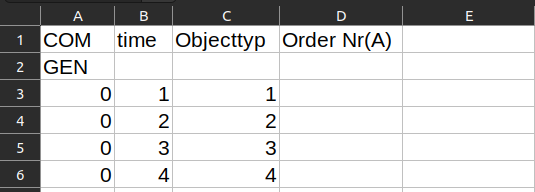
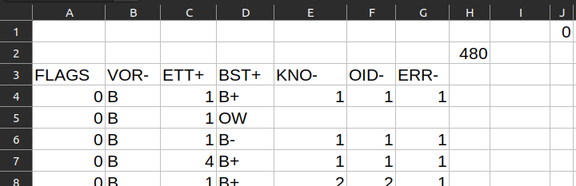
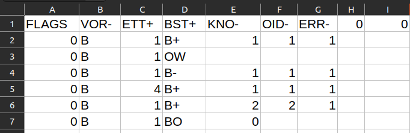

# Queue Analyzer

This standalone app is the Graphical user interface version of the python program written to generate a distribution for arrival and analyse the results from the Dosimis software. The app is written in python version 3.10 and GUI is enabled with GTK 3.5 with Glide software.

## Table of Contents

- [Installation](#installation)
- [Usage](#usage)
- [How it works](#how-it-works)
- [Contributing](#contributing)
- [License](#license)
- [Author](#author)

## Installation

The App can be run in three ways.

1. Download .exe windows executable file.[Download Link](https://drive.google.com/file/d/112hH66TlmQ7xwqi7EwZhJhfROGHBMQms/view?usp=share_link)https://drive.google.com/file/d/112hH66TlmQ7xwqi7EwZhJhfROGHBMQms/view?usp=share_link
2. Build the .exe file using pyinstaller.run 'pyinstaller -w --onefile Queue Analyzer.py' in terminal.
   find executable in dist folder.
   Or use auto-py-to-exe for GUI experience.
   pip install auto-py-to-exe and then run auto-py-to-exe in terminal.
3. Run python script file. make sure the following dependencies are met before running Queue Analyzer.py file.

* Python 3.10 or newer
* Gtk version 3.0
* numpy
* matplotlib
* pandas
* datetime

## Usage

The App has Two functions, one is to generate arrival distribution for the Dosimis model and second is to analyse the results from the simulation of Dosimis model.
The top left corner shows the group of widgets to enter details for generating the arrival distribution. The first four text entries are for entering the persons/time slot for four different cases. The next row entries are simulation time and time slot value (time interval) respectively. Hovering mouse pointer shows which text entries for which. The Button next to it enables to save the .txt files at desired location. Once everything in order, clicking generate button will generate the data files for the Dosimis model, simultaneously appearing completion message.
The analyse part uses the rest of the widgets. Use file chooser button to load .tra files and input .txt files (arrival data) for the four cases. These files are in Dosimis model directory. Also note the module number of each module when modelling the model in Dosimis. Enter the module number at which object enter and exits in corresponding text entries. Once the details are loaded click the generate statistics to display the results.
The results will contain the following items.

1. Statistical data of total time spend and queue length (the time) at entrance for four cases.
2. Graph plotted between time spend vs number of peoples for four cases.
3. Second graph plotted between max time spend across each module and corresponding modules for four cases.

Subsequently a local directory is created and filled with data used for the results including the .png files of graphs.

## How it works

The program has two segments. First segment perform the task of arrival data generater and second segment consists of Queue analyzing part.

##### Data Generater

A raw string is created with template of input data for Dosimis.

First two rows are the part of templete and later rows with columns 1, 2, and 3 represents time, object type and order number respectively.

The arrival data is generated with regular interval and added to the raw string. Later that string saved as .txt format.

##### Queue Analyzer

The above illustration is the data from .tra file when space is used as the delimiter. It is then sliced and saved as .csv format.

The below illustraion is the result of the above change.

* First column indicates the time starting from the beginning of the simulation.
* Third column indicates identifying number of module.
* Fourth column indicates the keys to identifiy the current event corresponding to the time.

    - B+ indicates the entering time of object into the module.

    - B- indicates the exit time of object from module.

* Sixth column indicates the object number.

The idendified data is extracted into a dataframe. And that dataframe is used to form the data such as queue tine,dwell tiem etc.

##### Base64 Encoding

In order to have the ability of standalone -independant nature, all the depedn datas are encapsulated into python file.

The icon file encoded into base64 and stored as string values. it is then to decoded and directly used as icon.

Simlarly the glade file, which in xml format, is loaded as raw string and later loaded as GUI of the program.

## Contributing

Optimizing the project with size and run speed.

Making c version of the same App.

## License

GNU General Public License v3.0

## Author

Dipson

---
